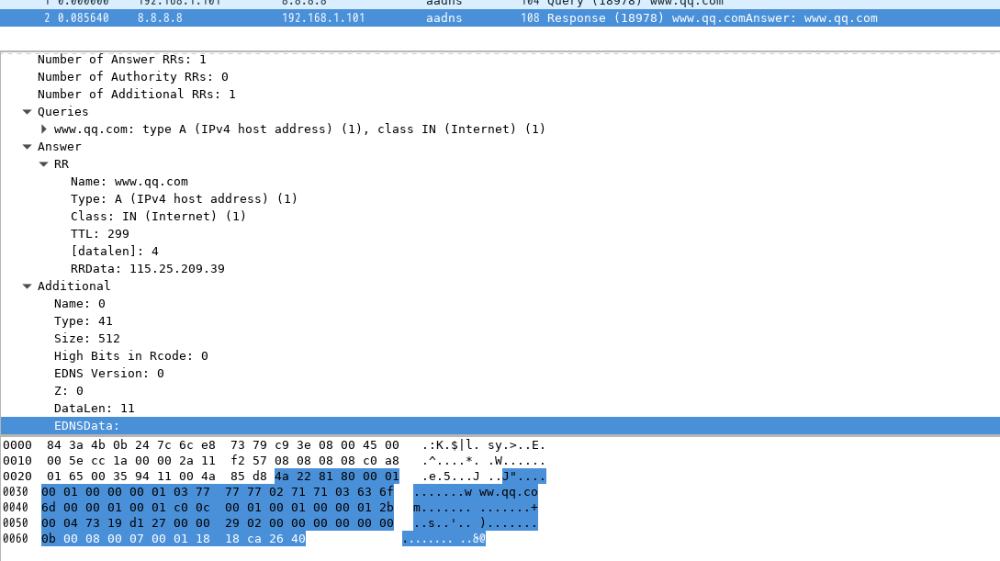

# wireshark_lua_dissector_dns
wireshark lua dissector for dns

support compress domain name (with bug)

support ecs opt

original  [dissector.lua](https://wiki.wireshark.org/Lua/Examples?action=AttachFile&do=get&target=dissector.lua) is from [Wireshark-Lua-Example](https://wiki.wireshark.org/Lua/Examples)

# install

for example,  aadns.lua is in /home/someusr/tshark_lua/  directory

/usr/share/wireshark/init.lua 

    dofile("/home/someusr/tshark_lua/aadns.lua")

# test

    $ cd /home/someusr/tshark_lua/
    $ tshark -X lua_script:aadns.lua -r ecs.pcap

or 

    Wireshark Gui -> Analyst -> Decode As -> AADNS

# reference

[Functions for new protocols and dissectors](https://www.wireshark.org/docs/wsdg_html_chunked/lua_module_Proto.html)

[wireshark-packet-dns.c](https://github.com/boundary/wireshark/blob/master/epan/dissectors/packet-dns.c)

[wireshark-Lua-Dissectors](https://wiki.wireshark.org/Lua/Dissectors)

[Chapter 10. Lua Support in Wireshark](https://www.wireshark.org/docs/wsdg_html_chunked/wsluarm.html)

[Lua Scripting in Wireshark](https://sharkfestus.wireshark.org/sharkfest.09/DT06_Bjorlykke_Lua%20Scripting%20in%20Wireshark.pdf)

[wireshark-plugins](https://github.com/kaos/wireshark-plugins)

